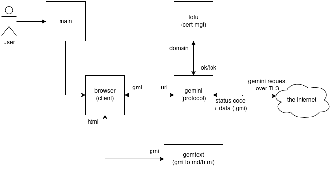

# Dioscuri

Yet another [Gemini](http://portal.mozz.us/gemini/geminiprotocol.net/) protocol implementation in Rust.  

Dioscuri brings Gemini (the protocol) to your web browser with customizability and accessibility at the forefront.  

Dioscuri works out of the box, but allows you to customize your browsing experience for Gemini websites.  
Roll your own js, html, css! [Quickstart](#quickstart).

[Dioscuri](https://en.wikipedia.org/wiki/Castor_and_Pollux) is the Greek name for Pollux and Castor, mythological twins that embody the **Gemini** constellation.  

## Showcase
Below are some themes that work out of the box. Find them in `themes/`.  

**Modern theme demo:**  


**Want to emulate the 2010s? No problem! Nyan demo**:  

  

**Need something minimal to work out of the box? Sure! Newspaper demo**  


Dioscuri is currently in **Beta**.
- this client supports basic surfing and browsing :white_check_mark:
- this client supports browser customizability! [See: User Hacking Guide](#user-hacking-guide)
- this client DOES NOT support user-state management yet (i.e. you provide your own cert) :x:
- this client DOES NOT properly handle gemini images yet :x:

## Vision
Dioscuri aims to be a hackable, accessible way to access hobbyist network protocols such as Gemini.

**Hackable**
- Dioscuri aims to allow you to roll your own html,css,js and themes to customize your experience.
  Similar vibes to old school Netscape or building your own Blogger website!

**Accessible**
- No need to install fancy GUI dependencies such as wxWidgets or curses or whatever which you won't use in a month's time
- Simply access Gemini from the convenience of a good-ol regular web browser!

### Quickstart

1. Download `dioscuri.exe` or `dioscuri` from the release page, based on your operating system.  
2. Launch the client! You might need to allow network access if you are using Windows.  
3. Out of the box, it probably looks ugly. Install a theme by copy pasting the files in `theme/a_theme` into the `.dioscuri/browser` directory.

### FAQ  

Q: I can't find `.dioscuri/browser/` to install themes! 
> If you are on Linux, `$ cd ~/.dioscuri/browser`  
> If you are on Windows, the folder is located on `C://Users/your_username/.dioscuri/browser/`

Q: Why does it look so ugly compared to the demo?
> Did you install a theme yet? Copy paste the theme files into the `.dioscuri/browser` directory! 

# User Hacking Guide

Dioscuri works out the box, but you can customize it.

See examples in the `themes` directory.

## Customizing the interface

Dioscuri will always load the following files from `~/.dioscuri/browser/` in this order:  
1. `head.html`
2. `body.html` if not homepage, else `home.html`

If `head.html` does not exist, then it will be skipped.  
If `body.html` does not exist, then Dioscuri will just serve the HTML rendered content directly.
If `home.html` does not exist, then Dioscuri will serve a default homepage.

### hacking `head.html` and using custom resources

Typically, in `head.html`, you would import stylesheets and various `js` to suit your browsing needs.  
HTML resources that use http(s) links will work out of the box. For example:  
``` html
<link rel="stylesheet" href="https://cdnjs.cloudflare.com/ajax/libs/font-awesome/6.5.2/css/all.min.css" />
```

But if you want to serve content **locally**, you must do the following:  
1. Place your file content in `~/.dioscuri/browser/{your_file_path}`  
2. reference it via `href="/.src/{your_file_path}`

Strict path matching is used.
- `href=".src/my_file.css"` will fail
- `href="/.src/my_file.css"` will work

For example, for `~/.dioscuri/browser/stylesheets/style.css`, use `href="/.src/stylesheets/style.css"` in your link tag.  

### Diosuri components
Dioscuri will automatically convert gemini protocol content into HTML.  
It will then search `body.html` for component HTML tags to inject HTML content there!  

Dioscuri will inject content in these components:
- `<Dioscuri/>` for normal content and error messages
- `<DioscuriPrompt/>` for input prompt
- `<DioscuriInput/>` for input field

**Two possibilities**:  
1. If the website you are on needs user input, Dioscuri will inject into `<DioscuriPrompt/>` and `<DioscuriInput/>`, and ignore `<Dioscuri/>`
2. If the website you are on just serves content, Dioscuri will inject into `<Dioscuri/>`, and ignore the other tags.

For example, consider this `body.html`:  
``` html
<body>
<h1>Hello, world!</h1>
<Dioscuri/>
<p>======</p> 
<h3><DioscuriPrompt></h3>
<p>++++++</p>
<DioscuriInput>
<h1 class="my_custom_class">Goodbye, world!</h1>
</body>
```  

If the website you talk to just returns a webpage:  

```html
<body>
<h1>Hello, world!</h1>
<h1>Injected Content</h1>
<h2>The injected content contains...</h2>
<p>Whatever the Gemini website serves,</p>
<a>Including links!</a>
<p>======</p> 
<p>++++++</p>
<h1 class="my_custom_class">Goodbye, world!</h1>
</body>
```

If the webpage requires your input (maybe you are using a search engine), then:  

``` html  
<body>
<h1>Hello, world!</h1>
<p>======</p> 
<h3>Enter your query!</h3>
<p>++++++</p>
<form method="get"><label><input type="text" name="query"></label><input type="submit" value="Submit"></form>
<h1 class="my_custom_class">Goodbye, world!</h1>
</body>
```  

For now, `<DioscuriInput/>` is not customizable. It will always be injected with `<form method="get"><label><input type="text" name="query"></label><input type="submit" value="Submit"></form>`  

#### Missing Components
If any Dioscuri components are missing, they will be automatically appended to the back of `body.html`.  

### Custom form content

If you really want to, you can add your own form content to interact directly with Dioscuri (specifically, the HTTP proxy).  
Note that the gemini protocol treats queries as user input.  

So, if you wanted to send user input for a page `foo.net/hello`, your form should send a GET request to the proxy as such:  
`GET http://localhost:port/foo.net/hello?q=Your User Input!`.  
Gemini protocol does not care about the key, just the value.  
Behind the scenes, the URL will be reformatted to `foo.net/hello?Your User Input!`. Notice that the form key "q" was thrown away.  

If you wanted to go directly to a particular website, your form should send a GET request to the proxy as such:  
`GET http://localhost:port/goto_this_site.com`.  
Dioscuri will go to `goto_this_site.com`. You can also just use your browser address bar and type in `http://localhost:port/goto_this_site.com` and it will work the same!  

# Developer Guide

## Architecture  

Each box denotes a submodule in the project.



We adhere strictly (within reason) to [single-responsibility](https://en.wikipedia.org/wiki/Single-responsibility_principle) principle.  
As such, each module should be doing semantically distinct things and not contaminate one another.  

## Installation
Unfortunately, you will have to build the binary for now.  

First, install cargo/rust on your machine.  
Then, fork this repo and run: `$ cargo run`.  
Open the client via any browser on `localhost:1965`.  
Enjoy Gemini!  